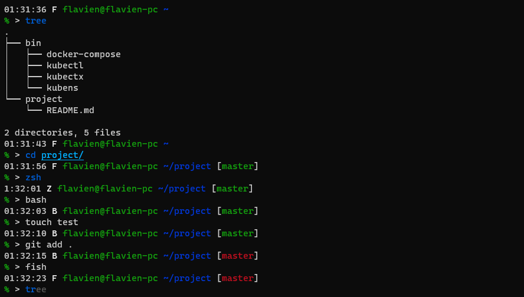

# Linux Configuration



Add and configure 3 different shells :

- bash
- zsh
- fish

These 3 shells then have equivalent prompts. These prompts have the following characteristics :

- Time display
- Display of the active shell (bash, zsh or fish)
- Display of the active user
- Display of the machine name
- Display of the current location
- Display of the branch [Git](https://git-scm.com/) of the current folder (if it exists)

## Installation

```sh
curl -s https://raw.githubusercontent.com/flavien-perier/linux-configuration/master/shell-configuration.sh | sudo sh -
```

Compatible with systems based on :

- [Debian](https://www.debian.org/) -> ([Ubuntu](https://ubuntu.com/), [Mint](https://linuxmint.com/), [Kali](https://www.kali.org/))
- [RedHat](https://www.redhat.com/) -> ([Fedora](https://getfedora.org/), [CentOS](https://www.centos.org/), [Rocky](https://rockylinux.org/))
- [Arch](https://archlinux.org/) -> ([Manjaro](https://manjaro.org/))
- [Alpine](https://www.alpinelinux.org/)

Compatible with the following architectures :

- x86/64
- ARMv7 -> [RaspberryPi](https://www.raspberrypi.org/) 2 and 3
- ARMv8_x64 -> RaspberryPi 4

